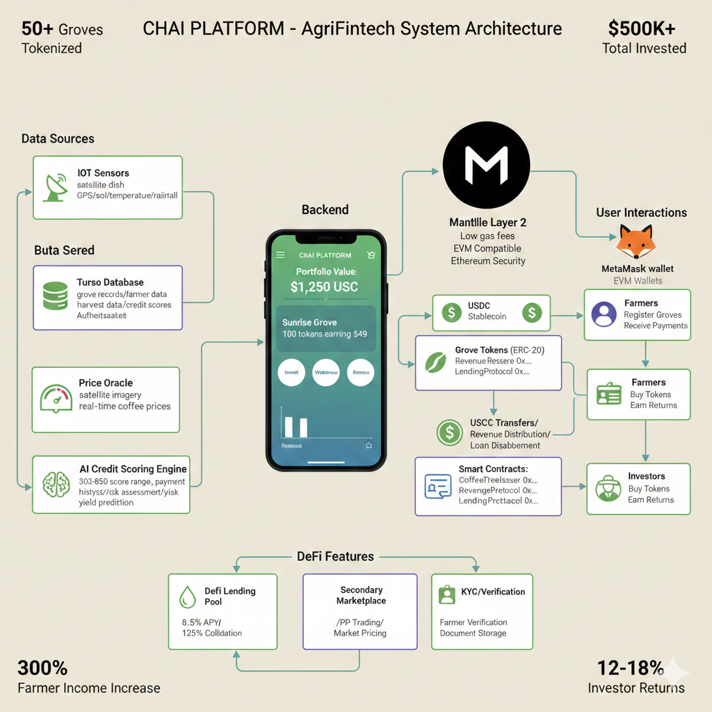

# Chai Platform - Coffee Tree Tokenization Platform

[](https://opensource.org/licenses/MIT)
[](https://mantle.xyz)
[](https://ethereum.org)


---

## 📋 Table of Contents
- [Project Overview](#-project-overview)
- [Mantle Network Integration](#-mantle-network-integration)
- [Quick Start](#-quick-start)
- [Architecture](#-architecture-diagram)
- [Deployed Contracts](#-deployed-contracts)

Chai Platform is a decentralized coffee tree tokenization platform built on Mantle Network. It enables farmers to tokenize their coffee groves and allows investors to purchase tokens representing ownership in coffee production, creating a transparent and efficient marketplace for sustainable coffee investment.

## 🌱 Project Overview

The Chai Platform connects coffee farmers with investors through blockchain technology, enabling:

- **Farmers** to register their groves and tokenize their coffee trees as ERC-20 tokens
- **Investors** to purchase tokens representing ownership in coffee production
- **Transparent revenue distribution** from coffee sales to token holders
- **Earnings withdrawal** allowing investors to withdraw their earnings as USDC directly to their wallet
- **Real-time monitoring** of tree health and environmental conditions
- **Secure MetaMask integration** for all platform interactions
- **Lending system** that allows investors to either provide liquidity to earn interest or take out loans using their coffee tree tokens as collateral

### Platform Statistics

- **50+ Groves Tokenized** across multiple regions
- **$500K+ Total Invested** by the community
- **300% Farmer Income Increase** through tokenization
- **12-18% Investor Returns** annually

## 🚀 Mantle Network Integration

**Scalable, cost-efficient tokenization of coffee trees with Ethereum security and modular Layer 2 architecture**

### Why Mantle Network?

- **Ultra-Low Gas Fees** - Significantly cheaper than Ethereum mainnet
- **High Throughput** - Fast transaction processing for seamless user experience
- **Ethereum Security** - Inherits Ethereum's security through optimistic rollups
- **EVM Compatible** - Full compatibility with Ethereum tools and standards
- **Modular Architecture** - Separates execution, settlement, and data availability for optimal performance
- **Energy Efficient** - Layer 2 solution with minimal environmental impact


(https://qawa-platform-frontend.onrender.com/)

Features available:
- ✅ Connect MetaMask wallet (Mantle Sepolia Testnet)
- ✅ Register and tokenize coffee groves as ERC-20 tokens
- ✅ Browse and invest in tokenized groves
- ✅ Track earnings and withdraw USDC
- ✅ Provide liquidity or take out loans
- ✅ Real-time revenue distribution
- ✅ Secondary marketplace trading

---

## 🏗️ System Architecture



### Architecture Overview

The Chai Platform is built on a modern, scalable architecture leveraging Mantle Network's Layer 2 capabilities:

```
┌──────────────────────────────────────────────────────────────────────┐
│                    FRONTEND (Vite + Vanilla JS)                      │
│  ┌────────────┐  ┌──────────────┐  ┌─────────────────────────┐     │
│  │ Dashboard  │  │ Wallet Modal │  │ Grove Tracker (Mapbox)  │     │
│  └────────────┘  └──────────────┘  └─────────────────────────┘     │
│         │                │                      │                    │
│         └────────────────┴──────────────────────┘                    │
│                          │                                           │
│                   [HTTP/WebSocket]                                   │
└──────────────────────────┼───────────────────────────────────────────┘
                           │
                           ▼
┌──────────────────────────────────────────────────────────────────────┐
│              BACKEND API (Node.js + Express)                         │
│  ┌──────────────┐  ┌──────────────┐  ┌──────────────────────┐      │
│  │ Lending API  │  │ Grove API    │  │ Revenue Distribution │      │
│  └──────────────┘  └──────────────┘  └──────────────────────┘      │
│         │                │                      │                    │
│         └────────────────┴──────────────────────┘                    │
│                          │                                           │
└──────────────────────────┼───────────────────────────────────────────┘
                           │
        ┌──────────────────┼──────────────────┐
        │                  │                  │
        ▼                  ▼                  ▼
┌──────────────┐  ┌──────────────────┐  ┌──────────────┐
│   DATABASE   │  │  MANTLE NETWORK  │  │   EXTERNAL   │
│   (SQLite)   │  │    (Sepolia)     │  │   SERVICES   │
├──────────────┤  ├──────────────────┤  ├──────────────┤
│ • Groves     │  │ • ERC-20 Tokens  │  │ • Mapbox API │
│ • Harvests   │  │ • Smart Contracts│  │ • Price Feed │
│ • Users      │  │ • Transactions   │  │ • IoT Sensors│
│ • Loans      │  │ • Block Explorer │  │              │
└──────────────┘  └──────────────────┘  └──────────────┘
                           │
                           ▼
                  ┌─────────────────┐
                  │ MANTLE SERVICES │
                  ├─────────────────┤
                  │ • ERC-20 Tokens │
                  │ • Smart Contracts│
                  │ • Layer 2 Rollup│
                  │ • RPC Nodes     │
                  └─────────────────┘

DATA FLOW:
1. User connects wallet → Frontend → Mantle Network (MetaMask verification)
2. User tokenizes grove → Backend API → Smart Contract → ERC-20 Token Creation
3. Investor buys tokens → Frontend → Smart Contract → ERC-20 Token Transfer
4. Harvest reported → Backend API → Database + Smart Contract → Revenue Distribution
5. Loan requested → Backend API → Smart Contract → USDC Transfer (ERC-20)
```

---

## 📍 Deployed Contracts

All contracts and tokens are deployed on **Mantle Sepolia Testnet**:

### Smart Contracts
| Contract | Address | Purpose |
|----------|---------|---------|
| **USDC Token** | `TBD` | ERC-20 stablecoin for payments |
| **Farmer Verification** | `TBD` | Farmer identity verification |
| **Price Oracle** | `TBD` | Coffee price feeds |
| **Coffee Tree Issuer** | `TBD` | Grove tokenization orchestration |
| **Lending Pool** | `TBD` | Lending and borrowing functionality |
| **LP Token** | `TBD` | Liquidity provider tokens |
| **Marketplace** | `TBD` | Secondary market for grove tokens |

### Network Information
| Parameter | Value |
|-----------|-------|
| **Network** | Mantle Sepolia Testnet |
| **Chain ID** | 5003 |
| **RPC URL** | https://rpc.sepolia.mantle.xyz |
| **Currency** | MNT |
| **Block Explorer** | https://explorer.sepolia.mantle.xyz |
| **Faucet** | https://faucet.sepolia.mantle.xyz |

### Contract Verification
All contracts are verified on Mantle Explorer for transparency:
- View source code
- Read contract state
- Interact with contracts directly

---

Features available in the live demo:
- ✅ View 42 mapped coffee groves
- ✅ Connect MetaMask wallet (Mantle Sepolia)
- ✅ Browse investment opportunities
- ✅ Real-time grove tracking with satellite imagery
- ✅ Interactive dashboard with market data

### Local Development Setup

### Prerequisites

- **Node.js 18+** or 20+
- **pnpm** package manager (`npm install -g pnpm`)
- **MetaMask Wallet** (browser extension) - [Download here](https://metamask.io/)
- **Mantle Sepolia Testnet MNT** (get free MNT from [faucet.sepolia.mantle.xyz](https://faucet.sepolia.mantle.xyz/))
- **Private Key** for contract deployment (export from MetaMask)

### Installation

```bash
# Clone the repository
git clone https://github.com/i-mwangi/mantle.git
cd mantle

# Install dependencies
pnpm install

# Copy and configure environment variables
cp .env.example .env
# Edit .env with your configuration
```

### Configure MetaMask for Mantle Sepolia

Add Mantle Sepolia network to MetaMask:

1. Open MetaMask
2. Click network dropdown → "Add Network"
3. Enter these details:
   - **Network Name:** Mantle Sepolia Testnet
   - **RPC URL:** https://rpc.sepolia.mantle.xyz
   - **Chain ID:** 5003
   - **Currency Symbol:** MNT
   - **Block Explorer:** https://explorer.sepolia.mantle.xyz

### Get Testnet Tokens

Get free MNT for testing:
```bash
# Visit the faucet
https://faucet.sepolia.mantle.xyz/

# Request 100 MNT to your wallet address
```

### Deploy Contracts

```bash
# Compile contracts
npm run compile:mantle

# Deploy to Mantle Sepolia Testnet
npm run deploy:mantle:testnet

# Or deploy to local Hardhat network for testing
npx hardhat node  # Terminal 1
npm run deploy:mantle:local  # Terminal 2
```

### Starting the Development Environment

**Backend API Server (Mock)**
```bash
pnpm run api:mock
# Server running on http://localhost:3001
```

**Frontend Development Server**
```bash
pnpm run frontend:vite
# ➜  Local:   http://localhost:3000/
```

**Full Stack (with deployed contracts)**
```bash
pnpm run api  # Real API with blockchain
pnpm run frontend
```


## 📁 Project Structure

```
chai-platform/
├── abi/                 # Smart contract ABIs
├── api/                 # Backend API services
├── contracts/           # Solidity smart contracts
├── db/                  # Database schema and migrations
├── events/              # Event processing services
├── frontend/            # Frontend application
│   ├── css/             # Stylesheets
│   ├── js/              # JavaScript modules
│   ├── wallet/          # Wallet integration
│   ├── index.html       # Landing page
│   └── app.html         # Main application
├── lib/                 # Shared libraries
├── providers/           # Data providers
├── tests/               # Test suites
└── types/               # TypeScript definitions
```

## 🔐 Wallet Integration

The platform uses **MetaMask** for secure wallet integration with Mantle Network.

### Supported Wallets
- **MetaMask** (Browser Extension) - Primary wallet
- **Any EVM-compatible wallet** that supports custom networks

### Integration Details

Wallet integration is located in `frontend/wallet/` and includes:

- `metamask-connector.js` - MetaMask connection and interaction
- `manager.js` - High-level wallet API
- `modal.js` - Connection UI components
- `state.js` - Connection state management

### Usage Example

```javascript
// Connect MetaMask
await walletManager.connect();

// Check connection
if (walletManager.isWalletConnected()) {
  const address = walletManager.getAddress();
  console.log('Connected:', address);
}

// Send transaction
const result = await walletManager.sendTransaction({
  to: '0x1234...5678',  // recipient address
  value: ethers.parseEther('0.1')  // amount in MNT
});

// Listen to events
window.addEventListener('wallet-connected', (event) => {
  console.log('Connected:', event.detail.address);
});

window.addEventListener('wallet-disconnected', () => {
  console.log('Wallet disconnected');
});
```
## 💰 Lending System for Investors

The platform includes a comprehensive lending system that allows investors to either provide liquidity to earn interest or take out loans using their coffee tree tokens as collateral.

### Earnings & Withdrawals

Investors can track and withdraw their earnings:
- **View Balance:** See total earned, total withdrawn, and available balance
- **Withdraw Earnings:** Transfer available balance as USDC (ERC-20) directly to your wallet
- **Transaction History:** View complete withdrawal history with Mantle Explorer links
- **Automatic Approval:** ERC-20 tokens don't require association like HTS tokens

### Lending Pools

Investors can provide liquidity to lending pools and earn passive income through Annual Percentage Yield (APY):

- **USDC Pool**: Currently offering 8.5% APY

#### Providing Liquidity

1. Navigate to the "Lending & Liquidity" section in the investor portal
2. Select a lending pool (USDC or KES)
3. Enter the amount you wish to deposit
4. Review the estimated returns and LP tokens to receive
5. Confirm the transaction to deposit funds
6. Receive LP (Liquidity Provider) tokens proportional to your contribution

Benefits:
- Earn passive income through APY
- LP tokens can be withdrawn at any time with accrued rewards
- Support the lending ecosystem for other investors

#### Withdrawing Liquidity

1. Navigate to your liquidity positions in the lending section
2. Select the pool from which you want to withdraw
3. Enter the amount of LP tokens to burn
4. Review the USDC and rewards you'll receive
5. Confirm the transaction to withdraw funds

### Taking Out Loans

Investors can borrow USDC by locking their coffee tree tokens as collateral:

#### Loan Terms
- **Collateralization Ratio**: 125% (must lock $1.25 worth of tokens for every $1 borrowed)
- **Liquidation Threshold**: 90% (if token value drops to 90% of original, collateral may be liquidated)
- **Interest Rate**: 10% (repay 110% of borrowed amount)
- **Loan Duration**: 180 days

#### Process
1. Navigate to the "Loans" section in the lending area
2. System calculates maximum loan amount based on portfolio value
3. Click "Take Out Loan" button
4. Enter desired loan amount (up to maximum)
5. Review loan terms including collateral requirements and liquidation price
6. Confirm the transaction to receive USDC in wallet

#### Loan Management
- Real-time monitoring of loan health with visual indicators
- Automatic warnings for low health factors (below 1.2)
- Loans can be repaid at any time to unlock collateral
- Clear display of all loan terms and conditions

#### Repaying Loans
1. Navigate to your active loan in the lending section
2. Click "Repay Loan" button
3. Review repayment details including total amount and collateral to unlock
4. Confirm the transaction to repay the loan

### Risk Management
- Health factor monitoring with color-coded indicators (Healthy > 1.5, Monitor 1.2-1.5, At Risk < 1.2)
- Automatic notifications when health factor drops below safe levels
- Liquidation protection with 90% threshold
- Transparent pricing and terms displayed before confirming transactions


```

### Database Schema

Key tables include:
- `coffee_groves` - Registered coffee groves
- `harvest_records` - Harvest data and revenue
- `token_holdings` - Investor token ownership
- `farmer_verifications` - Farmer verification status
- `investor_verifications` - Investor verification status
- `transaction_history` - Financial transaction records
- `iot_sensor_data` - Environmental monitoring data

### Migrations

```bash
# Generate new migration
pnpm run generate

# Run migrations
pnpm run migrate

# View migration status
pnpm run migration:show
```

## ☁️ Turso Deployment

For production deployment, the platform uses Turso (SQLite-compatible edge database):

### Setup

1. Install Turso CLI:
   ```bash
   irm get.turso.tech/install.ps1 | iex
   ```

2. Create account and database:
   ```bash
   turso auth signup
   turso db create chai-platform
   ```

3. Get credentials:
   ```bash
   turso db show chai-platform --url
   turso db tokens create chai-platform
   ```

4. Update `.env`:
   ```env
   TURSO_DATABASE_URL=libsql://chai-platform-yourname.turso.io
   TURSO_AUTH_TOKEN=your-token-here
   ```

## 🏗️ Smart Contracts

Smart contracts are written in Solidity 0.8.29 and deployed on Mantle Network using standard ERC-20 tokens.

### Core Contracts

Located in `contracts/mantle/`:

- **`USDC.sol`** - ERC-20 stablecoin for payments and loans
- **`FarmerVerification.sol`** - Farmer identity verification and KYC
- **`CoffeePriceOracle.sol`** - Coffee price feeds and market data
- **`CoffeeTreeIssuer.sol`** - Grove registration and tokenization orchestration
- **`CoffeeTreeToken.sol`** - ERC-20 tokens representing coffee grove ownership
- **`LendingPool.sol`** - Lending and borrowing with collateralization
- **`LPToken.sol`** - Liquidity provider tokens for lending pools
- **`Marketplace.sol`** - Secondary market for trading grove tokens
- **`PaymentProcessor.sol`** - Revenue distribution to token holders

### ERC-20 Standard Benefits

- **No Token Association Required** - Unlike HTS, ERC-20 tokens work immediately
- **Universal Compatibility** - Works with all Ethereum wallets and tools
- **Standard Interfaces** - Follows EIP-20 specification
- **Gas Efficient** - Optimized for Mantle's Layer 2 architecture

### Deployment

```bash
# Compile contracts
npx hardhat compile

# Deploy to Mantle Sepolia Testnet
npm run deploy:mantle:testnet

# Deploy to local Hardhat network
npx hardhat node  # Terminal 1
npm run deploy:mantle:local  # Terminal 2

# Verify contracts on Mantle Explorer
npx hardhat verify --network mantleSepolia <CONTRACT_ADDRESS>
```

Contract addresses are configured in `.env`:
```env
MANTLE_USDC_ADDRESS=0x...
MANTLE_FARMER_VERIFICATION_ADDRESS=0x...
MANTLE_PRICE_ORACLE_ADDRESS=0x...
MANTLE_ISSUER_ADDRESS=0x...
MANTLE_LENDING_POOL_ADDRESS=0x...
MANTLE_LP_TOKEN_ADDRESS=0x...
```

### Contract Architecture

All contracts use OpenZeppelin libraries for security:
- `@openzeppelin/contracts/token/ERC20/ERC20.sol`
- `@openzeppelin/contracts/access/Ownable.sol`
- `@openzeppelin/contracts/security/ReentrancyGuard.sol`
- `@openzeppelin/contracts/security/Pausable.sol`

### Architecture

- **Frontend:** Static files served from `frontend/dist/`
- **API:** Single serverless function at `api/index.ts`
- **Build:** Vite for frontend, tsup for backend
- **Database:** SQLite (local) / Turso (production)


## Monitoring & Analytics

The platform includes built-in analytics for:
- Coffee price tracking
- Revenue distribution monitoring
- User activity tracking
- Environmental sensor data visualization

## 🔒 Security

### Wallet Security
- All transactions require explicit user approval
- Private keys never leave the user's wallet
- Session persistence uses secure storage

### Data Security
- Database encryption at rest
- TLS encryption for all communications
- Regular security audits

### Access Control
- Role-based access control (Farmer/Investor/Admin)
- KYC verification for investors
- Farmer verification process

## 🤝 Contributing

1. Fork the repository
2. Create your feature branch (`git checkout -b feature/AmazingFeature`)
3. Commit your changes (`git commit -m 'Add some AmazingFeature'`)
4. Push to the branch (`git push origin feature/AmazingFeature`)
5. Open a pull request

## 📄 License

This project is licensed under the MIT License - see the [LICENSE](LICENSE) file for details.

## 🙏 Acknowledgments

- [Mantle Network](https://mantle.xyz) - Modular Layer 2 blockchain platform
- [Ethereum](https://ethereum.org) - EVM compatibility and standards
- [OpenZeppelin](https://openzeppelin.com) - Secure smart contract libraries
- [Hardhat](https://hardhat.org) - Ethereum development environment
- [MetaMask](https://metamask.io) - Wallet integration
- [Turso](https://turso.tech) - Edge database provider
- [Vercel](https://vercel.com) - Deployment platform

